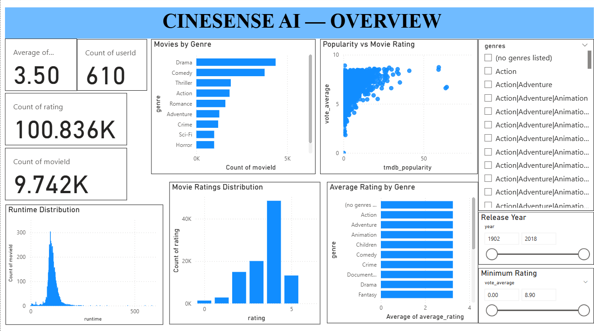
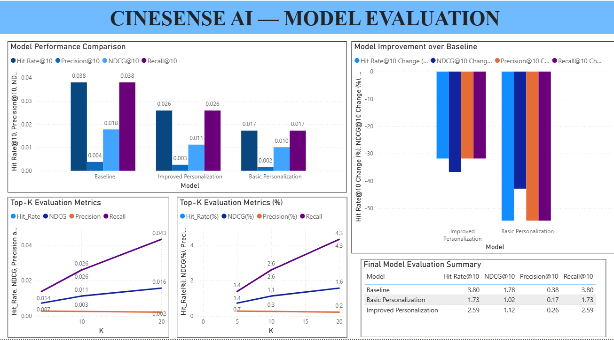
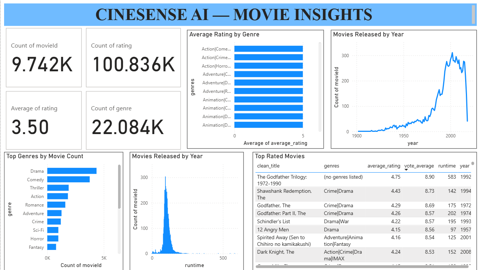

# 🎬 CineSense AI

An AI-powered Movie Recommendation System that combines **Content-Based Filtering**, **Context-Aware Recommendation**, **Personalized Recommendation**, and **Interactive Power BI Dashboards** to provide intelligent movie recommendations and recommendation performance analysis.

---

# 📌 Project Overview

CineSense AI recommends movies by analyzing movie metadata, genres, ratings, popularity, and user preferences. The project evaluates multiple recommendation models using standard recommendation system metrics and visualizes the results through interactive Power BI dashboards.

---

## 📷 Dashboard Preview

### Page 1 – Project Overview



### Page 2 – Model Evaluation



### Page 3 – Movie Insights



The project includes an interactive Power BI dashboard with three pages that provide insights into movie analytics, recommendation performance, and model evaluation.

---

# 🚀 Features

- Content-Based Movie Recommendation
- Context-Aware Recommendation
- Personalized Recommendation
- Genre-Based Preference Analysis
- Recommendation Evaluation Metrics
- Interactive Power BI Dashboard
- Movie Analytics and Visualization
- Model Performance Comparison

---

# 🛠 Technologies Used

## Programming Languages

- Python
- SQL

## Libraries

- Pandas
- NumPy
- Scikit-learn
- Matplotlib
- Seaborn

## Visualization

- Power BI

## Development Environment

- Google Colab
- Jupyter Notebook

## Version Control

- Git
- GitHub

---

# 📂 Project Structure

```text
CineSense-AI
│
├── api/
├── app/
├── dashboard/
│   └── PowerBI_Dashboard.pdf
│
├── data/
│   ├── raw/
│   ├── processed/
│   ├── powerbi/
│   └── README.md
│
├── images/
│   ├── dashboard_overview.png
│   ├── model_evaluation.png
│   └── movie_insights.png
│
├── notebooks/
│   ├── 01_data_understanding.ipynb
│   ├── 02_sql_analysis.ipynb
│   ├── 03_exploratory_data_analysis.ipynb
│   ├── 04_recommendation_engine.ipynb
│   ├── 05_tmdb_metadata_enrichment.ipynb
│   ├── 06_context_aware_recommendation.ipynb
│   ├── 07_recommendation_evaluation.ipynb
│   └── 08_visualization_and_analysis.ipynb
│
├── sql/
├── src/
├── README.md
├── requirements.txt
└── LICENSE
```

---

# 📊 Dataset

This project uses the **MovieLens Dataset** along with **TMDB Movie Metadata**.

The datasets include:

- Movie Titles
- Genres
- Ratings
- Popularity
- Runtime
- Release Year
- Vote Average
- Vote Count

---

# 📈 Recommendation Models

- Content-Based Recommendation
- Context-Aware Recommendation
- Personalized Recommendation

---

# 📏 Evaluation Metrics

- Precision@10
- Recall@10
- Hit Rate@10
- NDCG@10

---

# 📊 Power BI Dashboard

The dashboard provides interactive visualizations for movie analytics, recommendation performance, and evaluation metrics.

## Page 1 – Project Overview

- KPI Cards
- Genre Analysis
- Rating Distribution
- Popularity Analysis
- Runtime Distribution

## Page 2 – Model Evaluation

- Model Performance Comparison
- Improvement over Baseline
- Top-K Evaluation
- Evaluation Summary

## Page 3 – Movie Insights

- Top Rated Movies
- Genre Analysis
- Runtime Analysis
- Movies Released by Year

---

# ⚙ Installation

Clone the repository:

```bash
git clone https://github.com/jyothiboreddy1-netizen/CineSense-AI.git
```

Navigate to the project folder:

```bash
cd CineSense-AI
```

Install the required libraries:

```bash
pip install -r requirements.txt
```

---

# 🎯 Project Outcome

This project demonstrates practical skills in:

- Data Cleaning
- Data Analysis
- Recommendation Systems
- Machine Learning
- Data Visualization
- Dashboard Design
- Recommendation Evaluation

---

# 🔮 Future Enhancements

- Hybrid Recommendation System
- Deep Learning-based Recommendation
- Real-time User Personalization
- Streamlit Web Application
- Cloud Deployment
- User Authentication
- API Integration

---

# 👩‍💻 Author

**Jyothi Boreddy**

B.Tech Computer Science Engineering (Data Science)

---

# 📄 License

This project is licensed under the **MIT License**.
